# Anirudh Negi | Backend & Distributed Systems Engineer

<div align="center">


[](https://www.linkedin.com/in/anirudhnegi/)
[](https://negiadventures.github.io)
[](mailto:anirudh0993@gmail.com)

**Distributed systems · Graph & relational data modeling · Large-scale ETL · AI-native engineering**

</div>

---

## About

Backend engineer, 8+ years, currently at **GoFundMe** building event-driven integration and the data
systems behind search and recommendations. I work on the parts that are expensive to get wrong: schema
and API contracts, failure semantics, and migration strategy.

Outside of work I architect and operate two live products, **[Utilix](https://utilix.tech)** and
**[Karyfy](https://karyfy.com)**, built almost entirely through agentic AI workflows with Claude Code.
I own the architecture, the data model, and the reliability; the agents write most of the code. It's the
most interesting engineering problem I've worked on lately: the bottleneck stops being implementation
speed and becomes the quality of your specification.

---

## Building

### 🛠️ [Utilix](https://utilix.tech) · the tool layer for developers and AI agents

One shared tool registry serving **six delivery surfaces** from a single implementation, so a tool is
specified once and its contract holds identically everywhere instead of drifting across per-surface
rewrites.

| | |
|---|---|
| **180+ tools** | one registry, one source of truth, growing daily |
| **6 surfaces** | web app · REST API · Node SDK · Python SDK · embeddable widget · MCP server |
| **130+ MCP tools** | Zod-validated, stdio · works in Claude Code, Claude Desktop, Cursor |
| **8K+** | npm downloads/month across published packages |

[](https://www.npmjs.com/package/@utilix-tech/sdk)
[](https://www.npmjs.com/package/@utilix-tech/mcp)
[](https://pypi.org/project/utilix-sdk/)

→ **[github.com/utilix-tech](https://github.com/utilix-tech)** · [docs](https://docs.utilix.tech)

### 🎯 [Karyfy](https://karyfy.com) · AI job-search platform *(live, beta)*

A hub-and-spoke multi-service system: a FastAPI hub exposing **250+ REST endpoints** and owning identity,
entitlement, and orchestration, in front of internal services for AI routing, resume curation, job
extraction, coaching, career planning, and a shared identity schema.

The piece I'd point at first is the **AI Gateway**. No product service calls a model provider directly.
It gives us provider abstraction over OpenAI and Anthropic with automatic failover, a versioned prompt
registry with a `draft → canary → active → deprecated` lifecycle, tier-aware model routing under timeout
budgets, structured-output schema validation with deterministic error codes, and per-request tracing and
cost estimation.

`FastAPI` · `React/TS` · `PostgreSQL` · `Redis` · `OpenSearch` · `Kubernetes/Helm` · `Clerk` · `Creem`

---

## Work

```
2016 ──────────────────────────────────────────────────────────── Present
 │
 ├─ 2016-2019 │ Software Engineer · Mediaocean · Pune, India
 │              ↳ ETL pipelines into Greenplum; incremental load + CDC
 │              ↳ SQL/query-plan optimization for live analytics dashboards
 │              ↳ Docker containerization of ETL workflows
 │              ↳ Awards: Rising Star, Brand Value
 │
 ├─ 2019-2021 │ Software Developer · SymphonyAI · Bangalore, India
 │              ↳ Decomposed sequential ETL into concurrent stages: hours to minutes
 │              ↳ Elasticsearch indexing strategy, custom analyzers & tokenizers
 │              ↳ Cluster sizing and shard optimization
 │              ↳ Mentored engineers on distributed search & indexing design
 │
 ├─ 2021-2022 │ MS Computer Science · Rutgers University, New Brunswick, NJ
 │              ↳ Award: Academic Excellence
 │
 ├─ 2022-2023 │ Senior Java Developer · Genentech (Roche) · Remote, US
 │              ↳ Salesforce → enterprise DB migration framework, idempotent + rollback
 │              ↳ Spring Batch optimization: 60% runtime reduction
 │              ↳ AWS infrastructure provisioning with Terraform
 │
 └─ 2023-NOW  │ Software Engineer II, Backend & Platform · GoFundMe · Remote, US
               ↳ Event-driven integration platform (schema, retry/DLQ, delivery guarantees)
               ↳ Neo4j property-graph data model + sync pipeline for a recommendation product
               ↳ ETL across 1.8M+ charities and 6M+ fundraisers
               ↳ Algolia search-index sync: 10+ hour run → 4 hours
               ↳ LLM-backed content generation shipped to production
               ↳ Award: SPOT
```

---

## Other Projects

| Project | Tech | Description |
|---------|------|-------------|
| [**openclaw-skills**](https://github.com/negiadventures/openclaw-skills) | Python | Reusable OpenClaw skills for agent workflows |
| [**devspace-microservices**](https://github.com/negiadventures/devspace-microservices) | TypeScript, K8s | Microservices deployment with DevSpace orchestration |
| [**slackbot_bedrock**](https://github.com/negiadventures/slackbot_bedrock) | AWS Bedrock, TS | LLM-powered Slack bot via AWS Bedrock |
| [**market-summary-ai**](https://github.com/negiadventures/market-summary-ai) | Python, LLM | Market summaries with AI-written news content |
| [**network-curl-extension**](https://github.com/negiadventures/network-curl-extension) | JavaScript | Browser extension for network debugging & curl generation |

---

## Stack

**Languages** &nbsp;


**Frameworks** &nbsp;


**Data** &nbsp;


**Cloud & Infra** &nbsp;


**AI** &nbsp;


---

## Stats

<div align="center">

[](https://github.com/negiadventures)

[](https://github.com/negiadventures)

[](https://github.com/negiadventures)

</div>

<!-- STATS-START -->
<!-- Auto-generated on 2026-08-16 01:46 UTC -->

### 📊 Repository Statistics

**Total Public Repositories**: 40 &nbsp;|&nbsp; **Total Stars**: 11

**Distribution by Category**:

- **AI & Data Systems**: 8 repos
- **Backend & Infrastructure**: 16 repos
- **Educational & Research**: 8 repos
- **Client Work & Freelance**: 8 repos

**Recently Updated**:

- [`negiadventures`](https://github.com/negiadventures/negiadventures) — Aug 15, 2026
- [`negiadventures.github.io`](https://github.com/negiadventures/negiadventures.github.io) — Jul 26, 2026
- [`layover-games`](https://github.com/negiadventures/layover-games) — Apr 16, 2026
- [`openclaw-skills`](https://github.com/negiadventures/openclaw-skills) — Apr 10, 2026
- [`gamehub`](https://github.com/negiadventures/gamehub) — Apr 09, 2026

<!-- STATS-END -->

---

## Let's Connect

Happy to talk about backend architecture and scalability, graph and event-driven data systems, agentic
development workflows, or senior/staff engineering roles.

[](mailto:anirudh0993@gmail.com)
[](https://www.linkedin.com/in/anirudhnegi/)
[](https://negiadventures.github.io)
